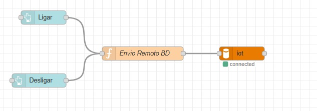
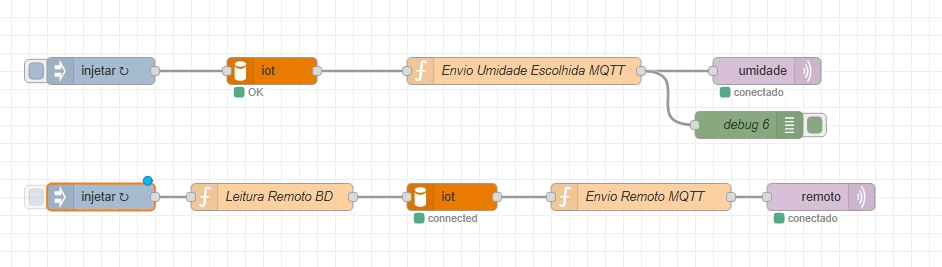

# HortaIFSP
Código e explicação da horta automatizada conectada a uma máquina virtual Azure.

IP máquina: 74.179.84.129

Foi utilizada uma máquina Ubuntu 24.04 que está rodando um broker MQTT, um banco de dados MySQL e um servidor Node-Red.

Implementação do Banco de dados utilizado no projeto:

A implementação no Node-red foi feita em etapas dividas.

Abaixo, tem-se os nós que fazem a leitura dos dados escritos em tópicos MQTT (vindo do ESP 32) e salvos para o banco de dados Mysql.

A seguir, implementação das leituras dos status de irrigação para o Dashboard.

Atuação dos botões de irrigação manual no dashboard, salvos no MySQL. 

Escolha de umidade limite no dashboard e envio para BD MySQL.

Nós para escrita de umidade escolhida e irrigação manual para MQTT que será lido pelo ESP 32.

Dashboard criado no servidor Node-Red:

A montagem física do sistema está representada abaixo onde potenciômetros foram inseridos para simular sensores e LEDs para simular atuadores.

Figuras de implementações reais dos sensores: 

Figuras de implementações reais dos atuadores: 

